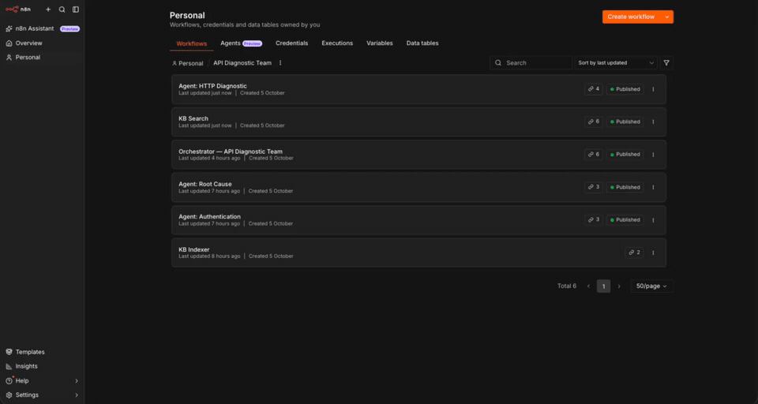
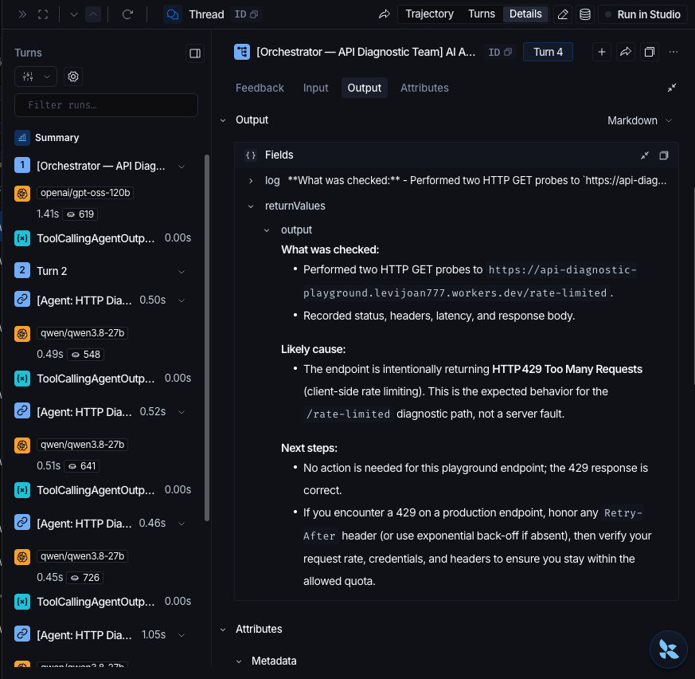

# AI API Diagnostic Team

A multi-agent API-troubleshooting team built low-code in n8n. Paste a URL, an
error, or a failing response — the team probes it, diagnoses the auth failure,
and returns a likely cause with next steps.

> **Eval:** 12/12 scenarios · **Status:** built and tested locally (hosted demo in progress)



## The problem

First-line API triage is manual work I did every day in support: read the status
code, check the headers, work out whether it's auth vs upstream vs a timeout,
then write it up clearly. It's the same handful of steps, dozens of times a day.

This project asks how much of that first pass a small team of agents can take on
— grounded in runbooks, and with a trace you can inspect when it gets something
wrong.

## Architecture

```
Chat Trigger (public)
      │
      ▼
Orchestrator  ── Postgres chat memory (session-scoped) + LangSmith thread
      │
      ├──► Agent: HTTP Diagnostic ── HTTP Request Tool
      │        └── KB Search (http-diagnostic runbook)
      ├──► Agent: Authentication ── evidence-based (never asks for credentials)
      │        └── KB Search (authentication runbook)
      └──► Agent: Root Cause ── Structured Output Parser
               └── KB Search (root-cause runbook)
      │
      ▼
diagnostic_audit (Supabase)   ·   LangSmith traces
```

The orchestrator is an AI Agent with session memory. Each specialist is **its
own AI Agent** (nested-agent pattern) exposed as a tool via *Call n8n Workflow
Tool*, and each has its own knowledge base. Supabase stores memory, the vector
store, and the audit log; LangSmith traces every run.

## The team

| Agent | Role | Grounding |
|---|---|---|
| **Orchestrator** | Coordinates; answers directly or routes to specialists | — |
| **HTTP Diagnostic** | Probes a public URL (status, redirects, headers, latency) | `http-diagnostic.md` |
| **Authentication** | Diagnoses 401/403/407 from **pasted evidence** — never asks for secrets | `authentication.md` |
| **Root Cause** | Synthesizes findings → `likely_cause`, `confidence`, `evidence`, `next_steps` | `root-cause.md` |

## Evaluation

**Score: 12/12** on the scenario set in [`eval/scenarios.md`](eval/scenarios.md),
covering seeded failures (expired token, 403, 500, 502, 429, wrong content-type,
timeout, redirect loop) plus paste-mode cases.

- **Method:** manual, one run per scenario; the Root-Cause verdict matched
  against the expected cause.
- **Limitations:** single trial per scenario; judge is the author. A larger,
  multi-trial suite would tighten the number.

## Observability

- **LangSmith:** every run traced to the `api-diagnostic-team` project; traces
  are grouped per session via a `thread_id` set in the agents' Tracing Metadata.
- **Audit:** each orchestrator run writes a row to `diagnostic_audit`
  (`session_id`, `request`, `agents_used`, `verdict`, `confidence`).



## Failure modes & what I learned

- **LLM rate limits.** Groq's free tier intermittently throttled a turn; Retry
  On Fail (3 tries, 5s) recovers it. This is a free-tier operational
  characteristic, not an eval failure.
- **`Retrieve as Tool` bug.** The Supabase Vector Store's tool mode threw
  `Expected object, received string`, so retrieval runs through a dedicated
  `KB Search` sub-workflow (Get Many + metadata filter by agent).
- **Free-tier RAM ceiling.** n8n 2.x on a 512 MB free host OOMs
  (`JavaScript heap out of memory`) under real load — a deployment constraint,
  documented below, not a design flaw.

## Deployment

Built and tested locally; the hosted demo is in progress. The intended target is
a self-hosted n8n instance (free web service + Supabase Postgres) with the editor
owner-locked and the Chat Trigger public. The free-tier RAM ceiling above is the
open constraint — the options are a paid instance tier, a managed n8n host, or a
small always-on VPS. Documented rather than hidden: knowing where the free tier
breaks is part of the work.

## Repo layout

```
knowledge-base/   per-agent runbooks (embedded to pgvector)
demo-api/         Cloudflare Worker playground with seeded failing endpoints
eval/             scenario set + scorecard
sql/              Supabase schema (pgvector, audit, memory)
workflows/        sanitized n8n exports (re-select credentials on import)
scripts/          sanitizer for workflow exports
```

## How to run

1. Apply [`sql/schema.sql`](sql/schema.sql) in Supabase.
2. Import the `workflows/` into n8n (order: `KB Search` → agents → `KB Indexer`
   → `Orchestrator`); re-select credentials and re-link sub-workflows.
3. Run `KB Indexer` to embed the knowledge bases.
4. Open the Chat Trigger's public chat and send a diagnosis request.

## Stack

n8n (self-hosted Community) · Groq (`gpt-oss-120b`) · Google Gemini embeddings
(`gemini-embedding-001`) · Supabase (Postgres + pgvector) · LangSmith · Cloudflare
Workers (demo targets).
